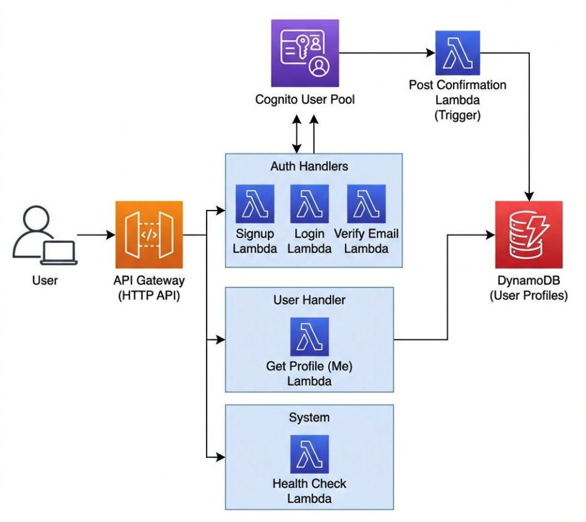

# CognitoKit

A robust, serverless authentication starter kit built with AWS CDK, Cognito, API Gateway, Lambda, and DynamoDB.



## Features
- **AWS Cognito Auth**: Complete user management with User Pool and Client.
- **Serverless API**: API Gateway backed by Node.js Lambda functions.
- **Secure Endpoints**: Protected routes using Cognito User Pool Authorizers.
- **Automated Profiles**: DynamoDB user profiles created automatically via Post-Confirmation triggers.
- **Type-Safety**: End-to-end type safety with TypeScript and Zod validation.
- **Infrastructure as Code**: Fully defined in AWS CDK.

## Architecture

The system follows a clean, event-driven architecture:
1.  **Auth**: Users sign up/login via Cognito.
2.  **Triggers**: Post-confirmation Lambda creates a user profile in DynamoDB.
3.  **API**: API Gateway routes requests to Lambda handlers.
4.  **Storage**: DynamoDB stores user profiles and application data.

## Prerequisites

- Node.js (v18+)
- AWS CLI configured with appropriate credentials
- AWS CDK installed globally (`npm install -g aws-cdk`)

## Quick Start

1.  **Install Dependencies**
    ```bash
    npm install
    ```

2.  **Deploy to AWS**
    ```bash
    npm run deploy
    ```

3.  **Clean Build Artifacts** (Optional)
    ```bash
    npm run clean
    ```

## API Endpoints

| Method | Endpoint | Description | Auth Required |
| :--- | :--- | :--- | :--- |
| `POST` | `/auth/signup` | Register a new user | No |
| `POST` | `/auth/login` | Authenticate user | No |
| `POST` | `/auth/verify-email` | Verify email with code | No |
| `GET` | `/auth/me` | Get current user profile | **Yes** |
| `GET` | `/health` | System health check | No |

## Project Structure

- `app/`: Lambda handlers and business logic.
- `infra/`: CDK infrastructure stacks and constructs.
- `app/common/`: Shared utilities (Zod, Logger, CORS).